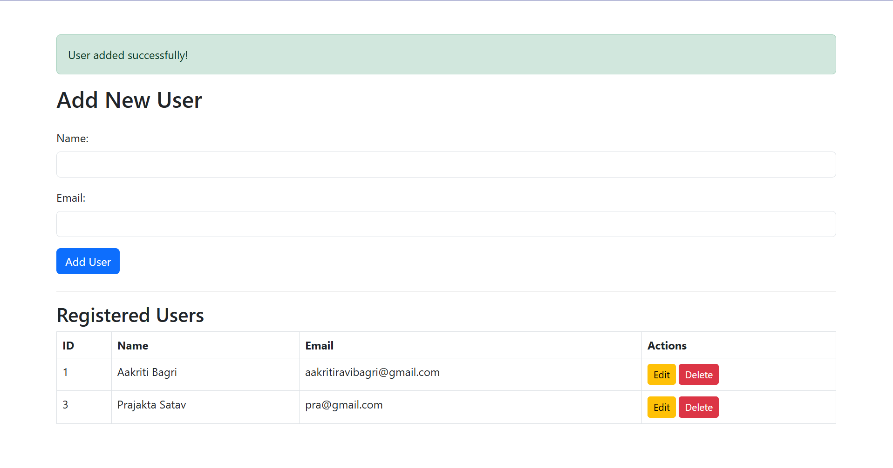

# PHP-MYSQL-App
# 🧑‍💻 PHP Dynamic Web Application with MySQL & Bootstrap

A simple dynamic web application built using PHP, MySQL, Bootstrap, and XAMPP to manage user records (Add, View, Edit, Delete). Ideal for beginners learning CRUD operations with PHP and MySQL.

---

## 📌 Features

- ✅ Add new users with name and email
- 📋 View all registered users in a table
- ✏️ Edit user details
- ❌ Delete users
- 🎨 Responsive UI with Bootstrap 5

---

## 🛠 Technologies Used

- PHP
- MySQL
- HTML/CSS
- Bootstrap 5
- XAMPP (Apache & MySQL)
- VS Code (IDE)

---

## ⚙️ Setup Instructions

### 1. Install Prerequisites
- [XAMPP](https://www.apachefriends.org/index.html)
- [VS Code](https://code.visualstudio.com/)
- Basic knowledge of PHP/MySQL



### 2. Clone the Repository
```bash
git clone https://github.com/your-username/dynamic-web-app.git
